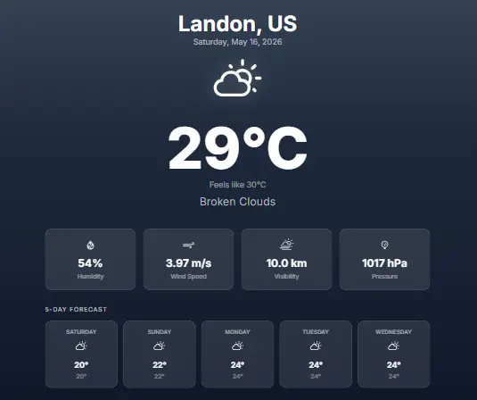

# 🌤️ SkyCast - Modern Weather Dashboard

SkyCast is a high-performance weather application built with **React.js** and **Tailwind CSS v4**. It features a dynamic UI that adapts its aesthetic based on real-time weather conditions.

## 📸 Preview


## ✨ Key Features
- **Adaptive UI:** The background gradient changes dynamically based on weather (Sunny, Rainy, etc.).
- **Live Data:** Integrated with OpenWeatherMap API for real-time accuracy.
- **Forecast:** Detailed 5-day weather predictions.
- **Search History:** Persistent recent searches using LocalStorage.
- **Tailwind v4:** Built using the latest CSS-first configuration logic.

## 🚀 Technical Stack
- **Frontend:** React (Vite)
- **Styling:** Tailwind CSS v4
- **Animations:** Framer Motion
- **Data:** Axios & OpenWeatherMap API

## 🛠️ Setup Instructions
1. Clone the repo:
   ```bash
   git clone [https://github.com/Shafi810/weather-dashboard.git](https://github.com/Shafi810/weather-dashboard.git)